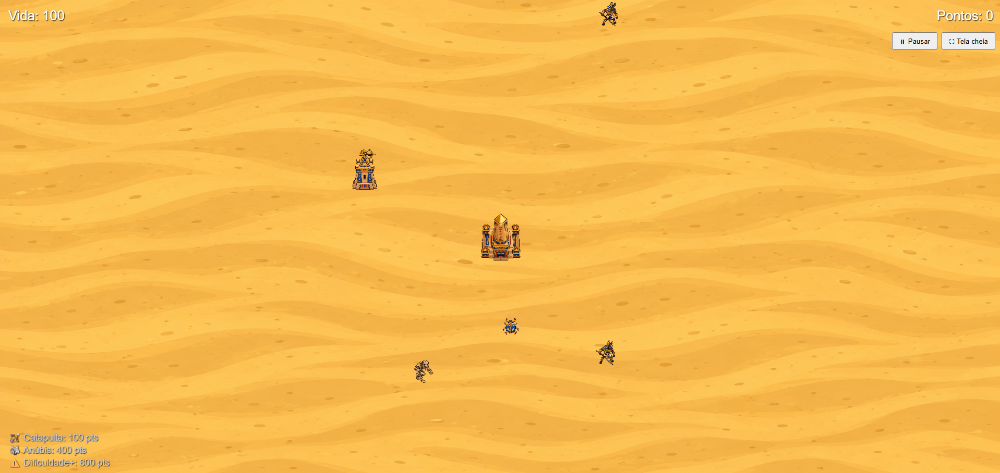
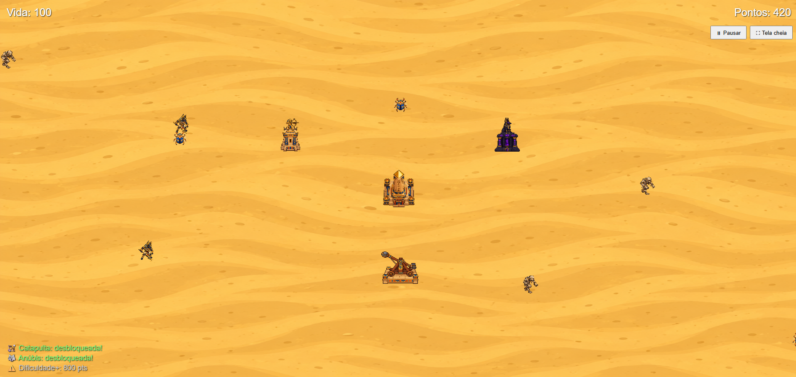
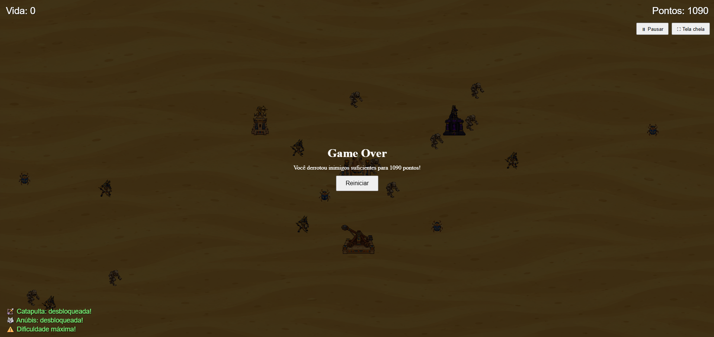

# Guardiões do Templo

## (a) O Jogo
"Guardiões do Templo" é um jogo de Defesa de Torres (Tower Defense) 2D com tema de Egito Antigo, feito em WebGL2. O jogador protege um templo sagrado no meio do deserto contra ondas de inimigos (múmias, escaravelhos e guerreiros chacal) usando torres automáticas que atiram sozinhas, além de poder atacar diretamente clicando nos inimigos. Conforme a pontuação aumenta, novas torres são desbloqueadas e a dificuldade cresce.

**Jogue aqui:** https://caiquepadua.github.io/utf-cg-tp1/

## (b) Criador(es)
Caíque Gomes de Pádua — contato: nadacaique@gmail.com

## (c) Media kit

## (d) Opcionais

Itens implementados (texto copiado do enunciado):

- ⭐ **Inimigos diferentes:** faça inimigos visual e mecanicamente diferentes, como com velocidades distintas, frequência de ataque, dano etc.
  - *Implementado: Múmia (lenta, resistente), Escaravelho (rápido, frágil, ataca rápido) e Guerreiro Chacal (intermediário em tudo), cada um com sprite, vida, velocidade, dano e cadência de ataque próprios.*

- ⭐ **Torres diferentes:** além de haver mais de uma torre, permita ao jogador escolher dentre diferentes tipos, como por exemplo uma "torre de gelo" que deixa o inimigo mais lento, ou uma "torre canhão" que atinge uma área e pode causar dano em vários inimigos com cada tiro.
  - *Implementado: Torre do Guarda (arco, equilibrada), Torre de Anúbis (aplica lentidão temporária no inimigo atingido) e Catapulta (causa dano em área a todos os inimigos próximos do ponto de impacto).*

- ⭐ **Novas torres:** deixe o jogador construir novas torres.
  - *Implementado como progressão automática por pontuação: o jogo começa só com a Torre do Guarda; a Catapulta é desbloqueada ao atingir 100 pontos, e a Torre de Anúbis ao atingir 400 pontos, aumentando também a dificuldade a cada desbloqueio (além de um aumento extra de dificuldade aos 800 pontos).*

- 🌟 **Sons:** colocar efeitos sonoros e música de fundo no seu jogo.
  - *Implementado: música de fundo tema Egito Antigo, em loop, iniciada na primeira interação do jogador (respeitando a política de autoplay dos navegadores).*

## (e) Créditos

- **Música de fundo:** https://www.youtube.com/watch?v=vfBImdv5fDE&list=PLXxcWbbLnYTLWPkARD9WZQsFEH4FXvEVU
- **Sprites (templo, torres, inimigos, projéteis, fundo):** gerados com auxílio de IA generativa de imagens.